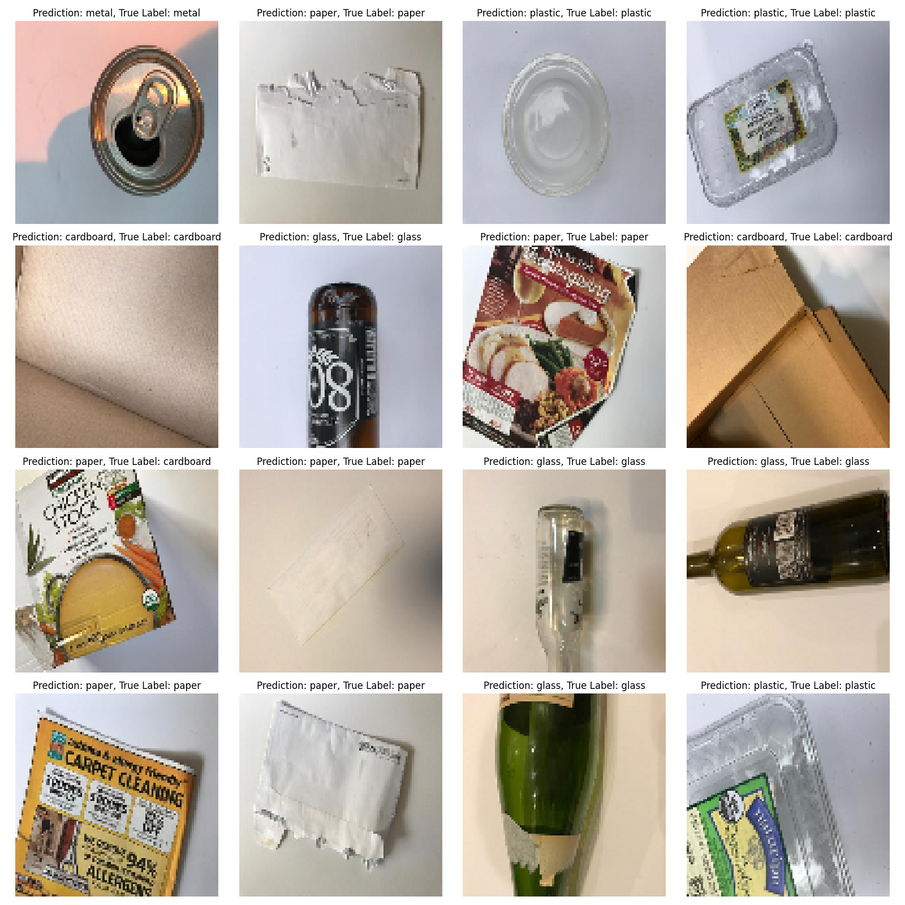

# garbage_classification
## Purpose
The purpose of this project is to classify the type of garbage (cardboard, glass, metal, paper, plastic, other types of garbage) in the uploaded photos.
This project can be developed to be used as a recycling aid in the future.

## Prediction Examples:

dataset: https://www.kaggle.com/datasets/asdasdasasdas/garbage-classification

app: https://garbageclassifier.streamlit.app/
